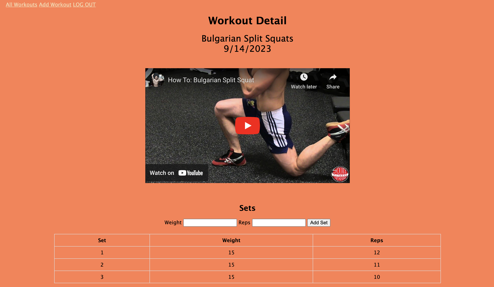

# Workout Tracker App

I created this workout application to help users track their exercises in order to facilate consistent progression and muscle growth. Upon landing on the homepage, the user is prompted to login into the google via OAuth. Once logged-in, the user will land on the "Workout History" page which indexes all the workouts inputed. On the top left nav bar, the user can add a workout. After picking which workout they want to use the user will then land on a "Workout Detail" page for the corresponding workout which includes a video and the functionality to add sets. Sets include the weight used and the number of reps which helps users track their workout activity so they know where to start off at for the next time the do that workout. 

## Screenshots

## Technologies Used
- HTML
- CSS
- JavaScript
- Node.js
- Express.js
- MongoDB

## Getting Started
Click  to access the app

## Next Steps
- Add feature to add, delete, and edit sets
- Add feature that calculates suggested weight and number of reps based on past inputted workout data by user